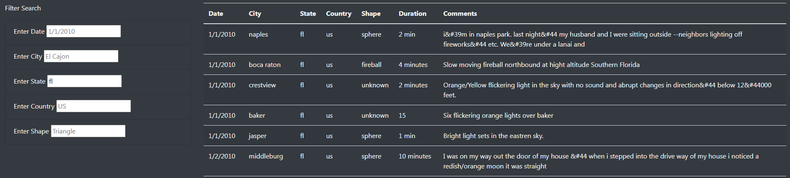
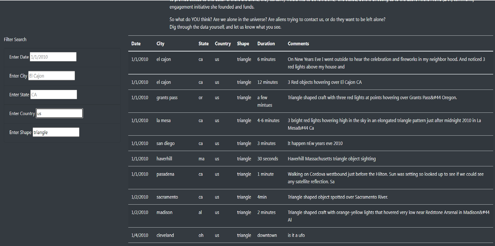
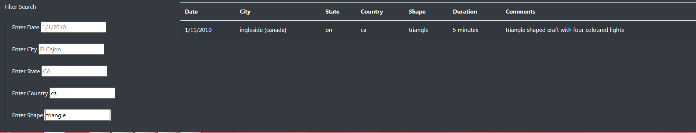
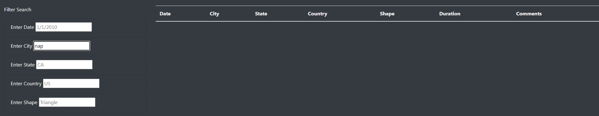

# UFOs
## Overview
The purpose of this project is to provide users researching UFOs a way to filter sightings. This project provides a way to apply multiple filters so users can get the data they are looking for. This will also give the ability to dig deep when conducting analysis and trending.

## Results
This webpage provides users lots of freedom to research whatever they need to about UFO sightings based on the data provided. If someone was curious about sightings where they live they could easily filter out the city or the state which they reside. The user will enter the abbreviation of the state that they want and hti enter. They can do the same for states, shape, date and city. Example below is for a filter on the state of Florida.

Using these filters anyone who is seriously researching UFO sightings could apply any number of combinations. If the researcher has a hypothesis about the shape of UFO sightings and the country in which they are found they could use this to see if their hypothesis could have any backing or not. For example, below is a screenshot of the site using the shape filter triangle and the US as the country.

Here is another comparing circle and Canada.

## Summary
A major drawback that I can see with this design is that the filters do not auto-filter. The user has to hit enter to make the filer work and if the user enters partial information the filer will not work. Using the image of the Florida filer above we can see the city of Naples with a sighting. However, if we were to search Nap in the city name the result comes up blank. 

This makes the filters very unfriendly to users. One recommendation is to include auto-filters. In the property appraiser website for Orange County, Florida the filters there utiilize a drop down box that populates with possible results as you type narrowing down letter by letter or number by number. This makes the website extemely easy to use. Another recommendation is the data set. The data is very United States focused. Any researcher will not get very much use with such a narrow scope. 
